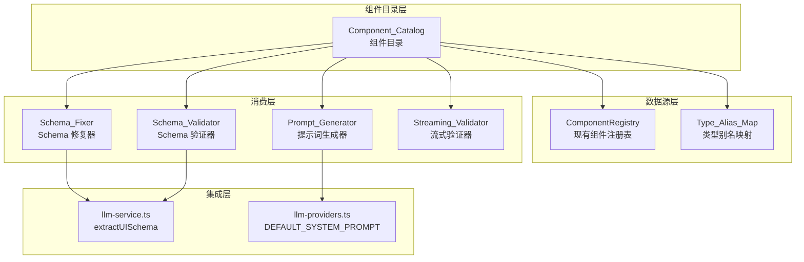

# 设计文档

## 概述

本设计文档描述了 Agent 输出优化功能的技术实现方案。核心思想是建立组件目录作为单一数据源，从中派生验证规则和系统提示词，确保 LLM 输出的 UI Schema 符合预定义规范。

### 设计目标

1. **单一数据源**: 组件定义、验证规则、提示词从同一数据源派生
2. **严格验证**: 在渲染前拦截无效 Schema
3. **智能修复**: 自动修复常见的 LLM 输出错误
4. **向后兼容**: 与现有代码无缝集成

## 架构



## 组件和接口

### 1. Component_Catalog 模块

**文件**: `src/lib/component-catalog.ts`

```typescript
/**
 * 类型别名映射
 */
export const TYPE_ALIAS_MAP: Record<string, string> = {
  'btn': 'Button',
  'div': 'Container',
  'img': 'Image',
  'txt': 'Text',
  'lbl': 'Label',
  // ... 更多别名
};

/**
 * 组件元数据（从 ComponentDefinition 派生）
 */
export interface ComponentMetadata {
  name: string;
  category: string;
  description: string;
  propsSchema: Record<string, PropSchema>;
  examples?: ComponentExample[];
  deprecated?: boolean;
  deprecationMessage?: string;
}

/**
 * Component_Catalog 类
 */
export class ComponentCatalog {
  private registry: ComponentRegistry;
  private validTypes: Set<string>;
  private typeAliases: Map<string, string>;
  
  constructor(registry: ComponentRegistry);
  
  /** 获取所有组件元数据 */
  getAllMetadata(): ComponentMetadata[];
  
  /** 获取按类别分组的组件 */
  getByCategory(): Record<string, ComponentMetadata[]>;
  
  /** 获取有效类型列表 */
  getValidTypes(): string[];
  
  /** 检查类型是否有效（包括别名） */
  isValidType(type: string): boolean;
  
  /** 解析类型别名，返回规范名称 */
  resolveAlias(type: string): string | undefined;
  
  /** 获取组件的 propsSchema */
  getPropsSchema(type: string): Record<string, PropSchema> | undefined;
}

/** 默认目录实例 */
export const defaultCatalog: ComponentCatalog;
```

### 2. Schema_Validator 增强

**文件**: `src/lib/validation.ts` (扩展)

```typescript
/**
 * 增强的验证错误
 */
export interface EnhancedValidationError extends ValidationError {
  /** 错误严重程度 */
  severity: 'error' | 'warning';
  /** 修复建议 */
  suggestion?: string;
}

/**
 * 增强的验证结果
 */
export interface EnhancedValidationResult {
  valid: boolean;
  errors: EnhancedValidationError[];
  warnings: EnhancedValidationError[];
}

/**
 * 验证选项
 */
export interface ValidationOptions {
  /** 是否启用组件类型验证 */
  validateComponentTypes?: boolean;
  /** 是否启用属性验证 */
  validateProps?: boolean;
  /** 使用的组件目录 */
  catalog?: ComponentCatalog;
}

/**
 * 增强的 UISchema 验证
 */
export function validateUISchemaEnhanced(
  input: unknown,
  options?: ValidationOptions
): EnhancedValidationResult;

/**
 * 计算 Levenshtein 距离
 */
export function levenshteinDistance(a: string, b: string): number;

/**
 * 获取相似类型建议
 */
export function getSimilarTypes(
  unknownType: string,
  validTypes: string[],
  maxSuggestions?: number
): string[];
```

### 3. Schema_Fixer 模块

**文件**: `src/lib/schema-fixer.ts`

```typescript
/**
 * 修复结果
 */
export interface FixResult {
  /** 是否成功修复 */
  fixed: boolean;
  /** 修复后的 Schema（如果成功） */
  schema?: UISchema;
  /** 应用的修复列表 */
  fixes: string[];
  /** 剩余的验证错误（如果修复失败） */
  remainingErrors?: EnhancedValidationError[];
}

/**
 * 修复选项
 */
export interface FixOptions {
  /** 是否修复缺失的 version */
  fixMissingVersion?: boolean;
  /** 是否修复类型别名 */
  fixTypeAliases?: boolean;
  /** 是否修复缺失的 id */
  fixMissingIds?: boolean;
  /** 是否修复大小写 */
  fixCasing?: boolean;
  /** 使用的组件目录 */
  catalog?: ComponentCatalog;
}

/**
 * 尝试修复 UISchema
 */
export function fixUISchema(
  input: unknown,
  options?: FixOptions
): FixResult;

/**
 * 生成唯一组件 ID
 */
export function generateComponentId(type: string): string;
```

### 4. Prompt_Generator 模块

**文件**: `src/lib/prompt-generator.ts`

```typescript
/**
 * 提示词生成选项
 */
export interface PromptGeneratorOptions {
  /** 使用的组件目录 */
  catalog?: ComponentCatalog;
  /** 是否包含示例 */
  includeExamples?: boolean;
  /** 是否包含负面示例 */
  includeNegativeExamples?: boolean;
  /** 输出语言 */
  language?: 'zh' | 'en';
}

/**
 * 生成系统提示词
 */
export function generateSystemPrompt(
  options?: PromptGeneratorOptions
): string;

/**
 * 生成组件文档部分
 */
export function generateComponentDocs(
  catalog: ComponentCatalog
): string;

/**
 * 生成正面示例
 */
export function generatePositiveExamples(): string;

/**
 * 生成负面示例
 */
export function generateNegativeExamples(): string;
```

### 5. Streaming_Validator 模块

**文件**: `src/lib/streaming-validator.ts`

```typescript
/**
 * 流式验证警告
 */
export interface StreamingWarning {
  /** 警告类型 */
  type: 'unknown_component' | 'invalid_structure';
  /** 警告消息 */
  message: string;
  /** 检测到的值 */
  value?: string;
  /** 在流中的位置 */
  position?: number;
}

/**
 * 流式验证器
 */
export class StreamingValidator {
  private buffer: string;
  private warnings: StreamingWarning[];
  private catalog: ComponentCatalog;
  
  constructor(catalog?: ComponentCatalog);
  
  /** 接收流式数据块 */
  feed(chunk: string): void;
  
  /** 获取当前警告 */
  getWarnings(): StreamingWarning[];
  
  /** 重置状态 */
  reset(): void;
  
  /** 完成流式传输，返回完整验证结果 */
  finalize(): EnhancedValidationResult;
}
```

## 数据模型

### 类型别名映射

```typescript
const TYPE_ALIAS_MAP = {
  // HTML 元素别名
  'div': 'Container',
  'span': 'Text',
  'img': 'Image',
  'a': 'Link',
  
  // 缩写别名
  'btn': 'Button',
  'txt': 'Text',
  'lbl': 'Label',
  'inp': 'Input',
  'sel': 'Select',
  'chk': 'Checkbox',
  'tbl': 'Table',
  
  // 常见拼写变体
  'textfield': 'Input',
  'textbox': 'Input',
  'dropdown': 'Select',
  'checkbox': 'Checkbox',
};
```

### 验证错误码

| 错误码 | 描述 | 严重程度 |
|--------|------|----------|
| UNKNOWN_COMPONENT | 未知的组件类型 | error |
| MISSING_REQUIRED_PROP | 缺少必填属性 | error |
| INVALID_PROP_TYPE | 属性类型错误 | error |
| INVALID_ENUM_VALUE | 枚举值无效 | error |
| MISSING_ID | 缺少组件 ID | error |
| MISSING_VERSION | 缺少版本号 | warning |
| DEPRECATED_COMPONENT | 使用了已弃用的组件 | warning |
| CASE_MISMATCH | 组件类型大小写不匹配 | warning |

## 正确性属性

*正确性属性是应该在系统所有有效执行中保持为真的特征或行为——本质上是关于系统应该做什么的形式化陈述。属性作为人类可读规范和机器可验证正确性保证之间的桥梁。*

### Property 1: 组件目录同步一致性

*对于任意* ComponentRegistry 中注册的组件，Component_Catalog 的 getValidTypes() 返回的列表应当包含该组件的类型名称。

**验证: 需求 1.1, 1.3, 1.4**

### Property 2: 类型别名解析正确性

*对于任意* Type_Alias_Map 中定义的别名，调用 resolveAlias(alias) 应当返回对应的规范类型名称，且该名称应当在 getValidTypes() 列表中。

**验证: 需求 1.5, 1.6**

### Property 3: Schema 验证完整性

*对于任意* 有效的 UISchema（所有组件类型有效、必填属性存在、属性类型正确），validateUISchemaEnhanced 应当返回 valid: true 且 errors 数组为空。

**验证: 需求 2.1, 2.2, 2.3, 2.4**

### Property 4: 验证错误码正确性

*对于任意* 包含未知组件类型的 UISchema，validateUISchemaEnhanced 应当返回包含 code: "UNKNOWN_COMPONENT" 的错误，且 suggestion 字段包含相似类型建议。

**验证: 需求 2.5, 6.2**

### Property 5: Schema 修复往返一致性

*对于任意* 可修复的 UISchema（仅包含缺失 version、类型别名、缺失 id、大小写错误），fixUISchema 返回的 schema 应当通过 validateUISchemaEnhanced 验证。

**验证: 需求 4.1, 4.2, 4.3, 4.4, 4.5**

### Property 6: 提示词生成完整性

*对于任意* Component_Catalog 中的组件，generateSystemPrompt 生成的提示词应当包含该组件的类型名称和属性描述。

**验证: 需求 3.1, 3.2, 3.3, 3.7**

### Property 7: 流式验证检测正确性

*对于任意* 包含 "type": "xxx" 模式的流式数据块，如果 xxx 不是有效类型，StreamingValidator.feed() 后 getWarnings() 应当包含该未知类型的警告。

**验证: 需求 5.2, 5.3**

### Property 8: 向后兼容性

*对于任意* 通过现有 validateUISchema 验证的 UISchema，validateUISchemaEnhanced 在默认选项下也应当返回 valid: true。

**验证: 需求 7.1, 7.5**

## 错误处理

### 验证错误处理

1. **未知组件类型**: 返回错误并建议相似类型
2. **缺少必填属性**: 返回错误并列出缺失的属性名
3. **类型不匹配**: 返回错误并显示期望类型
4. **枚举值无效**: 返回错误并列出有效值

### 修复失败处理

1. 如果 Schema 结构严重损坏（如 root 不是对象），返回 fixed: false
2. 如果存在无法自动修复的错误（如未知组件类型无别名），返回剩余错误列表
3. 保留所有有效部分，只修复可修复的问题

### 流式验证错误处理

1. 检测到问题时添加警告，不中断流
2. 累积所有警告直到 finalize()
3. finalize() 时进行完整验证

## 测试策略

### 单元测试

1. **Component_Catalog 测试**
   - 测试与 ComponentRegistry 的集成
   - 测试类型别名解析
   - 测试元数据导出

2. **Schema_Validator 测试**
   - 测试各种错误类型的检测
   - 测试 Levenshtein 距离计算
   - 测试建议生成

3. **Schema_Fixer 测试**
   - 测试各种修复场景
   - 测试递归修复
   - 测试修复失败情况

4. **Prompt_Generator 测试**
   - 测试输出格式
   - 测试组件文档生成
   - 测试示例生成

5. **Streaming_Validator 测试**
   - 测试数据块处理
   - 测试警告累积
   - 测试 reset 和 finalize

### 属性测试

使用 fast-check 库进行属性测试，每个属性测试至少运行 100 次迭代。

1. **Property 1 测试**: 生成随机组件定义，注册后验证目录同步
2. **Property 2 测试**: 遍历所有别名，验证解析正确性
3. **Property 3 测试**: 生成有效 UISchema，验证通过
4. **Property 4 测试**: 生成包含未知类型的 Schema，验证错误码
5. **Property 5 测试**: 生成可修复 Schema，验证修复后通过验证
6. **Property 6 测试**: 注册组件后验证提示词包含组件信息
7. **Property 7 测试**: 发送包含未知类型的数据块，验证警告
8. **Property 8 测试**: 使用现有有效 Schema，验证增强验证兼容
