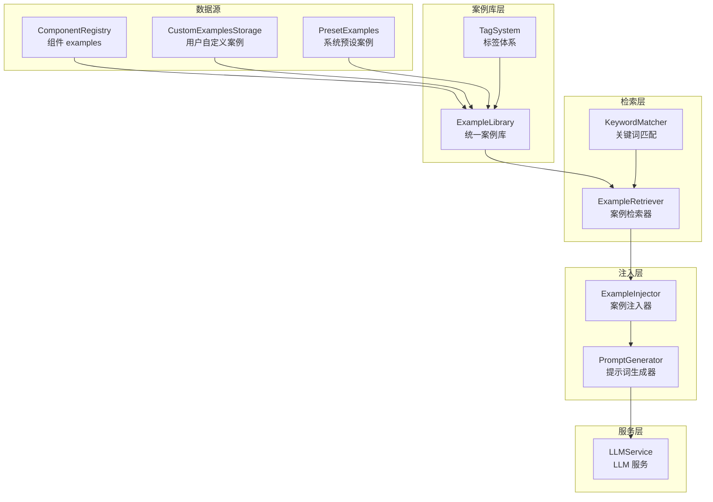

# 设计文档：案例驱动生成

## 概述

本设计文档描述了 LLM2UI 系统中案例驱动生成功能的技术实现方案。该功能通过建立统一的案例库、智能检索机制和提示词注入系统，让 LLM 能够参考相关案例生成更高质量的 UI Schema。

### 设计目标

1. **统一案例管理**：整合系统预设案例和用户自定义案例
2. **智能检索**：根据用户输入智能匹配相关案例
3. **无缝集成**：与现有 Prompt Generator 和 LLM Service 无缝集成
4. **可扩展性**：支持案例分类、标签和搜索

### 设计决策

| 决策 | 选择 | 理由 |
|------|------|------|
| 案例存储 | 内存 + localStorage | 系统案例在内存中，用户案例在 localStorage，保持现有架构 |
| 检索算法 | 关键词匹配 + 权重排序 | 简单高效，无需额外依赖，满足当前需求 |
| 案例注入位置 | 组件文档之后，格式要求之前 | 让 LLM 先了解组件，再参考案例，最后遵循格式 |
| 标签体系 | 预定义标准 + 允许自定义 | 平衡规范性和灵活性 |

## 架构



## 组件和接口

### 1. ExampleLibrary（案例库）

统一管理所有 UI 案例的核心模块。

```typescript
/**
 * 案例元数据接口
 */
interface ExampleMetadata {
  /** 唯一标识符 */
  id: string;
  /** 案例标题 */
  title: string;
  /** 案例描述 */
  description: string;
  /** 案例分类 */
  category: ExampleCategory;
  /** 案例标签 */
  tags: string[];
  /** UI Schema */
  schema: UISchema;
  /** 来源：system（系统预设）或 custom（用户自定义） */
  source: 'system' | 'custom';
  /** 关联的组件名称（可选） */
  componentName?: string;
}

/**
 * 案例库类
 */
class ExampleLibrary {
  /**
   * 获取所有案例
   */
  getAll(): ExampleMetadata[];
  
  /**
   * 按 ID 获取案例
   */
  getById(id: string): ExampleMetadata | undefined;
  
  /**
   * 按分类获取案例
   */
  getByCategory(category: ExampleCategory): ExampleMetadata[];
  
  /**
   * 按分类分组获取所有案例
   */
  getAllByCategory(): Record<ExampleCategory, ExampleMetadata[]>;
  
  /**
   * 按标签筛选案例
   */
  filterByTags(tags: string[]): ExampleMetadata[];
  
  /**
   * 全文搜索案例（搜索 title 和 description）
   */
  search(query: string): ExampleMetadata[];
  
  /**
   * 刷新案例库（从数据源重新加载）
   */
  refresh(): void;
}
```

### 2. ExampleRetriever（案例检索器）

根据用户输入检索相关案例。

```typescript
/**
 * 检索选项
 */
interface RetrievalOptions {
  /** 最大返回数量，默认 3 */
  maxResults?: number;
  /** 分类过滤 */
  category?: ExampleCategory;
  /** 最低相关度阈值，0-1，默认 0.1 */
  minScore?: number;
}

/**
 * 检索结果
 */
interface RetrievalResult {
  /** 案例元数据 */
  example: ExampleMetadata;
  /** 相关度分数，0-1 */
  score: number;
  /** 匹配的关键词 */
  matchedKeywords: string[];
}

/**
 * 关键词映射配置
 */
interface KeywordMapping {
  /** 关键词列表 */
  keywords: string[];
  /** 映射到的标签 */
  tags?: string[];
  /** 映射到的分类 */
  category?: ExampleCategory;
  /** 权重加成 */
  boost: number;
}

/**
 * 案例检索器类
 */
class ExampleRetriever {
  constructor(library: ExampleLibrary);
  
  /**
   * 检索相关案例
   * @param userInput 用户输入文本
   * @param options 检索选项
   * @returns 按相关度排序的案例列表
   */
  retrieve(userInput: string, options?: RetrievalOptions): RetrievalResult[];
  
  /**
   * 添加关键词映射
   */
  addKeywordMapping(mapping: KeywordMapping): void;
  
  /**
   * 获取所有关键词映射
   */
  getKeywordMappings(): KeywordMapping[];
}
```

### 3. ExampleInjector（案例注入器）

将检索到的案例格式化并注入到提示词中。

```typescript
/**
 * 注入选项
 */
interface InjectionOptions {
  /** 是否启用案例注入，默认 true */
  enabled?: boolean;
  /** 输出语言 */
  language?: 'zh' | 'en';
  /** 是否包含 schema JSON，默认 true */
  includeSchema?: boolean;
}

/**
 * 案例注入器类
 */
class ExampleInjector {
  /**
   * 格式化案例为 LLM 可理解的文本
   * @param examples 案例列表
   * @param options 注入选项
   * @returns 格式化的文本
   */
  format(examples: ExampleMetadata[], options?: InjectionOptions): string;
  
  /**
   * 获取默认案例（当没有检索到相关案例时使用）
   */
  getDefaultExamples(): ExampleMetadata[];
  
  /**
   * 生成案例引导说明
   */
  generateGuidance(language: 'zh' | 'en'): string;
}
```

### 4. TagSystem（标签体系）

管理标准分类和标签。

```typescript
/**
 * 标准案例分类
 */
type ExampleCategory = 
  | 'layout'      // 布局
  | 'form'        // 表单
  | 'navigation'  // 导航
  | 'dashboard'   // 仪表盘
  | 'display'     // 展示
  | 'feedback';   // 反馈

/**
 * 标准标签列表
 */
const STANDARD_TAGS = [
  // 布局相关
  'sidebar', 'header', 'footer', 'navbar', 'responsive',
  // 组件相关
  'card', 'table', 'list', 'modal', 'drawer', 'carousel',
  // 导航相关
  'breadcrumb', 'tabs', 'steps',
  // 功能相关
  'search', 'login', 'register', 'settings', 'profile',
  // 场景相关
  'admin', 'mobile'
] as const;

/**
 * 标签体系工具函数
 */
function getStandardCategories(): ExampleCategory[];
function getStandardTags(): string[];
function isStandardCategory(category: string): boolean;
function isStandardTag(tag: string): boolean;
function validateCategory(category: string): { valid: boolean; warning?: string };
```

### 5. PromptGenerator 扩展

扩展现有的 PromptGenerator 以支持案例注入。

```typescript
/**
 * 扩展的提示词生成选项
 */
interface PromptGeneratorOptions {
  catalog?: ComponentCatalog;
  includeExamples?: boolean;
  includeNegativeExamples?: boolean;
  language?: 'zh' | 'en';
  /** 新增：是否包含相关案例，默认 true */
  includeRelevantExamples?: boolean;
  /** 新增：用户输入，用于检索相关案例 */
  userInput?: string;
  /** 新增：案例检索选项 */
  retrievalOptions?: RetrievalOptions;
}

/**
 * 扩展的 generateSystemPrompt 函数
 * 
 * 生成的提示词结构：
 * 1. 系统介绍
 * 2. 有效类型约束
 * 3. 组件文档
 * 4. 通用属性说明
 * 5. 数据绑定示例
 * 6. 参考案例（新增）
 * 7. 正面示例
 * 8. 负面示例
 * 9. 结尾提示
 */
function generateSystemPrompt(options?: PromptGeneratorOptions): string;
```

### 6. LLMConfig 扩展

扩展 LLM 配置以支持案例增强。

```typescript
/**
 * 扩展的 LLM 配置
 */
interface LLMConfig {
  // ... 现有字段 ...
  
  /** 新增：是否启用案例增强，默认 true */
  enableExampleEnhancement?: boolean;
  /** 新增：案例检索选项 */
  exampleRetrievalOptions?: RetrievalOptions;
}
```

## 数据模型

### 案例元数据结构

```typescript
interface ExampleMetadata {
  id: string;           // 格式: "system-{category}-{index}" 或 "custom-{timestamp}-{random}"
  title: string;        // 案例标题，如 "Admin 侧边栏"
  description: string;  // 案例描述，如 "后台管理系统的侧边导航栏"
  category: ExampleCategory;
  tags: string[];       // 如 ["sidebar", "admin", "navigation"]
  schema: UISchema;     // 完整的 UI Schema
  source: 'system' | 'custom';
  componentName?: string; // 关联的组件名称（来自 ComponentRegistry 的案例）
}
```

### 预设案例数据

```typescript
const PRESET_EXAMPLES: ExampleMetadata[] = [
  // Layout 类别
  {
    id: 'system-layout-sidebar',
    title: 'Admin 侧边栏',
    description: '后台管理系统的侧边导航栏，包含菜单项和折叠功能',
    category: 'layout',
    tags: ['sidebar', 'admin', 'navigation'],
    source: 'system',
    schema: { /* ... */ }
  },
  // ... 更多预设案例
];
```

## 正确性属性

*正确性属性是系统应当满足的形式化规范，用于验证实现的正确性。每个属性都是一个普遍量化的陈述，描述了系统在所有有效输入下应当表现的行为。*

### Property 1: 数据聚合完整性
*对于任意* ComponentRegistry 中带有 examples 的组件，以及 CustomExamplesStorage 中的任意自定义案例，这些案例都应当出现在 ExampleLibrary 中，且元数据完整（包含 id、title、description、category、tags、schema、source）。

**Validates: Requirements 1.1, 1.2, 1.3**

### Property 2: 分类分组正确性
*对于任意* ExampleLibrary 中的案例集合，按 category 分组后，每个分组中的所有案例的 category 字段都应当等于该分组的键。

**Validates: Requirements 1.4**

### Property 3: 标签筛选正确性
*对于任意* 标签列表和 ExampleLibrary，filterByTags 返回的所有案例都应当至少包含一个指定的标签。

**Validates: Requirements 1.5**

### Property 4: 全文搜索正确性
*对于任意* 搜索查询和 ExampleLibrary，search 返回的所有案例的 title 或 description 都应当包含该查询字符串（不区分大小写）。

**Validates: Requirements 1.6**

### Property 5: 检索结果排序
*对于任意* 用户输入和检索选项，ExampleRetriever.retrieve 返回的结果列表应当按 score 降序排列。

**Validates: Requirements 2.1**

### Property 6: 关键词匹配正确性
*对于任意* 用户输入中包含的关键词，如果该关键词出现在某案例的 title、description 或 tags 中，该案例应当出现在检索结果中。

**Validates: Requirements 2.2**

### Property 7: 结果数量限制
*对于任意* maxResults 配置值 n，ExampleRetriever.retrieve 返回的结果数量应当不超过 n。

**Validates: Requirements 2.3**

### Property 8: 分类过滤正确性
*对于任意* category 过滤选项，ExampleRetriever.retrieve 返回的所有案例的 category 都应当等于指定的分类。

**Validates: Requirements 2.4**

### Property 9: 案例注入格式完整性
*对于任意* 非空案例列表，ExampleInjector.format 返回的文本应当包含：(1) "参考案例" 标题，(2) 引导说明，(3) 每个案例的标题、描述和 JSON schema。

**Validates: Requirements 3.1, 3.2, 3.3, 3.4**

### Property 10: 注入开关有效性
*对于任意* 案例列表，当 InjectionOptions.enabled 为 false 时，ExampleInjector.format 应当返回空字符串。

**Validates: Requirements 3.6**

### Property 11: 预设案例完整性
*对于任意* 预设案例，其 schema 中使用的所有组件类型都应当是 ComponentCatalog 中的有效类型。

**Validates: Requirements 4.5, 4.6**

### Property 12: 提示词结构正确性
*对于任意* 启用 includeRelevantExamples 且提供 userInput 的 PromptGeneratorOptions，生成的提示词应当按以下顺序包含各部分：系统介绍 → 组件文档 → 参考案例 → 格式要求 → 负面示例。

**Validates: Requirements 5.3, 5.4, 5.5**

### Property 13: 向后兼容性
*对于任意* includeRelevantExamples 为 false 的 PromptGeneratorOptions，生成的提示词应当与原有 generateSystemPrompt 的输出结构一致（不包含参考案例部分）。

**Validates: Requirements 5.6**

### Property 14: 标签验证灵活性
*对于任意* 案例，如果其 category 不是标准分类，validateCategory 应当返回 warning 但 valid 为 true；自定义 tags 应当被允许而不产生错误。

**Validates: Requirements 7.3, 7.4**

## 错误处理

### 案例库错误

| 错误场景 | 处理方式 |
|---------|---------|
| ComponentRegistry 不可用 | 仅使用预设案例和用户自定义案例 |
| CustomExamplesStorage 读取失败 | 记录警告，继续使用其他数据源 |
| 案例 schema 无效 | 跳过该案例，记录警告 |

### 检索错误

| 错误场景 | 处理方式 |
|---------|---------|
| 用户输入为空 | 返回默认案例 |
| 无匹配案例 | 返回空列表，由 Injector 使用默认案例 |
| 检索超时 | 返回空列表，记录警告 |

### 注入错误

| 错误场景 | 处理方式 |
|---------|---------|
| 案例列表为空 | 使用默认案例 |
| schema 序列化失败 | 跳过该案例的 schema 部分 |

## 测试策略

### 单元测试

1. **ExampleLibrary 测试**
   - 数据聚合测试：验证从各数据源正确加载案例
   - 分类分组测试：验证 getByCategory 和 getAllByCategory
   - 标签筛选测试：验证 filterByTags
   - 搜索测试：验证 search 功能

2. **ExampleRetriever 测试**
   - 关键词匹配测试：验证基本检索功能
   - 排序测试：验证结果按相关度排序
   - 限制测试：验证 maxResults 配置
   - 过滤测试：验证 category 过滤

3. **ExampleInjector 测试**
   - 格式化测试：验证输出格式正确
   - 开关测试：验证 enabled 配置
   - 默认案例测试：验证空输入时使用默认案例

4. **PromptGenerator 集成测试**
   - 结构测试：验证提示词各部分顺序
   - 兼容性测试：验证禁用时的行为

### 属性测试

使用 fast-check 进行属性测试，每个测试至少运行 100 次迭代。

```typescript
// Property 1: 数据聚合完整性
describe('Property 1: Data Aggregation Completeness', () => {
  it('should include all examples from all sources with complete metadata', () => {
    fc.assert(
      fc.property(
        arbitraryComponentWithExamples(),
        arbitraryCustomExample(),
        (component, customExample) => {
          // 验证聚合完整性
        }
      ),
      { numRuns: 100 }
    );
  });
});

// Property 5: 检索结果排序
describe('Property 5: Retrieval Result Ordering', () => {
  it('should return results sorted by score descending', () => {
    fc.assert(
      fc.property(
        fc.string({ minLength: 1 }),
        (userInput) => {
          const results = retriever.retrieve(userInput);
          for (let i = 1; i < results.length; i++) {
            expect(results[i].score).toBeLessThanOrEqual(results[i - 1].score);
          }
        }
      ),
      { numRuns: 100 }
    );
  });
});
```

### 测试配置

- 测试框架：Vitest
- 属性测试库：fast-check
- 覆盖率目标：80%
- 每个属性测试最少 100 次迭代
