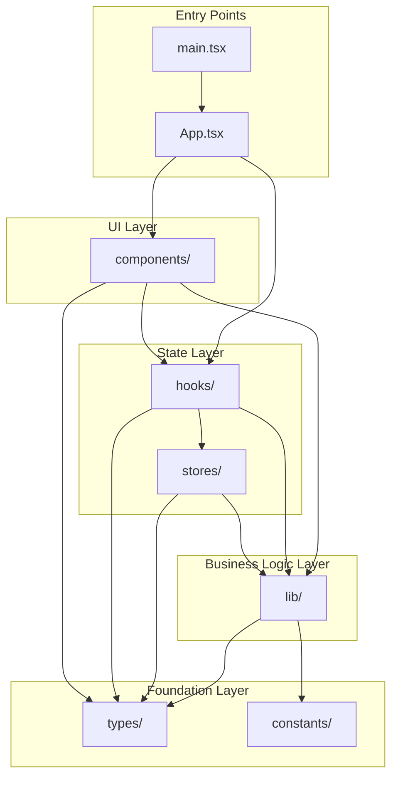

# src

<!-- 一旦我所属的文件夹有所变化，请更新我 -->

## 架构说明

LLM2UI 应用源代码目录，采用领域驱动的模块化架构。

## 目录结构

```
src/
├── components/     # UI 组件
├── lib/            # 核心库（按领域拆分）
├── hooks/          # 自定义 React Hooks
├── stores/         # Zustand 状态管理
├── types/          # TypeScript 类型定义
├── constants/      # 常量定义
├── assets/         # 静态资源
├── test/           # 测试配置
├── App.tsx         # 应用入口组件
├── main.tsx        # 应用启动入口
└── index.css       # 全局样式
```

## 子目录索引

| 目录 | 用途 | README |
|------|------|--------|
| [components/](./components/README.md) | UI 组件，按功能分组（chat、editor、layout、preview、settings、showcase、ui） | ✅ |
| [lib/](./lib/README.md) | 核心库，按领域拆分（core、llm、design-system、examples、storage、utils） | ✅ |
| [hooks/](./hooks/README.md) | 自定义 React Hooks（useSchemaSync、useLLMConfig、useEditorResize、useChatState） | ✅ |
| [stores/](./stores/README.md) | Zustand 状态管理（appStore） | ✅ |
| [types/](./types/README.md) | TypeScript 类型定义（ui-schema、llm、example、design-tokens、state） | ✅ |
| [constants/](./constants/README.md) | 常量定义（storage-keys、defaults、platforms） | ✅ |
| assets/ | 静态资源（图片、图标等） | - |
| test/ | 测试配置和工具 | - |

## 架构关系图



## 层级说明

### UI Layer (components/)

用户界面组件，按功能模块组织：

- **chat/** - 聊天界面组件
- **editor/** - 编辑器组件（JSON、数据绑定）
- **layout/** - 布局组件
- **preview/** - 预览面板组件
- **settings/** - 设置对话框组件
- **showcase/** - 组件展示模块
- **ui/** - 基础 UI 组件（shadcn-ui）

### State Layer (stores/, hooks/)

状态管理和可复用逻辑：

- **stores/appStore** - 集中式状态管理（Zustand）
- **hooks/** - 自定义 Hooks，封装业务逻辑

### Business Logic Layer (lib/)

核心业务逻辑，按领域拆分：

- **core/** - 核心渲染模块
- **llm/** - LLM 服务模块
- **design-system/** - 设计系统模块
- **examples/** - 案例系统模块
- **storage/** - 持久化模块
- **utils/** - 工具函数模块

### Foundation Layer (types/, constants/)

基础设施：

- **types/** - 全局类型定义
- **constants/** - 全局常量

## 导入路径别名

项目配置了 `@/` 路径别名，指向 `src/` 目录：

```typescript
// 推荐的导入方式
import { Button } from '@/components/ui/button';
import { useAppStore } from '@/stores';
import { useSchemaSync } from '@/hooks';
import { validateUISchema, render } from '@/lib';
import type { UISchema } from '@/types';
import { STORAGE_KEYS } from '@/constants';
```

## 相关需求

- Requirements 8.3: 创建 src/README.md 提供目录概览

## 更新提醒

任何目录结构变更后，请更新此文档。
