# lib

<!-- 一旦我所属的文件夹有所变化，请更新我 -->

## 架构说明

核心库目录，包含 LLM2UI 系统的核心逻辑。按领域拆分为多个子目录，所有模块通过 index.ts 统一导出，保持向后兼容。

### 子目录结构

| 子目录 | 功能描述 | README |
|--------|----------|--------|
| [core/](./core/README.md) | 核心渲染模块：组件注册表、组件目录、渲染引擎、验证、Schema 修复、数据绑定、事件处理、序列化 | ✅ |
| [llm/](./llm/README.md) | LLM 相关模块：LLM 服务、提供商预设、配置管理、提示词生成、流式验证、重试机制 | ✅ |
| [design-system/](./design-system/README.md) | 设计系统模块：Design Tokens、Token 使用映射、组件 Token 映射、Token 合规验证、约束注入、验证链 | ✅ |
| [examples/](./examples/README.md) | 案例系统模块：案例库、案例检索器、案例注入器、案例标签、案例组成分析器、预设案例、自定义案例存储 | ✅ |
| [storage/](./storage/README.md) | 持久化模块：自定义模型管理器等存储相关功能 | ✅ |
| [utils/](./utils/README.md) | 工具函数模块：通用工具、错误处理、Monaco 配置、平台适配、模板管理、图标注册、Schema 生成/同步、导出 | ✅ |

### 架构关系图

```mermaid
graph TB
    subgraph "lib/"
        Index[index.ts<br/>统一导出入口]
        
        subgraph "core/"
            CR[component-registry]
            CC[component-catalog]
            R[renderer]
            V[validation]
            SF[schema-fixer]
            DB[data-binding]
            EH[event-handler]
            S[serialization]
        end
        
        subgraph "llm/"
            LS[llm-service]
            LP[llm-providers]
            LCM[llm-config-manager]
            PG[prompt-generator]
            SV[streaming-validator]
            RM[retry-mechanism]
        end
        
        subgraph "design-system/"
            DT[design-tokens]
            TUR[token-usage-registry]
            CMR[component-mapping-registry]
            TCV[token-compliance-validator]
            CI[constraint-injector]
            VC[validation-chain]
        end
        
        subgraph "examples/"
            EL[example-library]
            ER[example-retriever]
            EI[example-injector]
            ET[example-tags]
            ECA[example-composition-analyzer]
            PE[preset-examples]
            CES[custom-examples-storage]
        end
        
        subgraph "storage/"
            CMM[custom-model-manager]
        end
        
        subgraph "utils/"
            U[utils]
            ERH[error-handling]
            MC[monaco-config]
            PA[platform-adapter]
            TM[template-manager]
            IR[icon-registry]
            SG[schema-generator]
            SS[schema-sync]
            EX[export]
        end
    end
    
    Index --> core/
    Index --> llm/
    Index --> design-system/
    Index --> examples/
    Index --> storage/
    Index --> utils/
    
    llm/ --> core/
    llm/ --> examples/
    design-system/ --> core/
    examples/ --> core/
```



## 向后兼容性

所有公共 API 通过 `src/lib/index.ts` 统一导出，确保现有的 `@/lib` 导入路径继续工作：

```typescript
// 这些导入方式都继续有效
import { ComponentRegistry, validateUISchema, render } from '@/lib';
import { LLMService, sendMessage } from '@/lib';
import { getDefaultDesignTokens, TokenComplianceValidator } from '@/lib';
import { ExampleLibrary, ExampleRetriever } from '@/lib';
import { CustomModelManager } from '@/lib';
import { cn, generateId, SchemaSyncer } from '@/lib';

// 命名空间导出（推荐用于避免命名冲突）
import { Core, DesignSystem, LLM, Examples, Utils, Themes } from '@/lib';
// 使用: Core.ComponentRegistry, LLM.sendMessage, etc.

// 也可以直接从子目录导入
import { ComponentRegistry } from '@/lib/core';
import { LLMService } from '@/lib/llm';
import { getDefaultDesignTokens } from '@/lib/design-system';
import { ExampleLibrary } from '@/lib/examples';
import { CustomModelManager } from '@/lib/storage';
import { cn, generateId } from '@/lib/utils';
```

## 根目录文件索引

重构后，根目录仅保留必要的入口文件和状态管理模块：

| 文件名 | 功能描述 |
|--------|----------|
| index.ts | 统一导出入口，从各子目录 re-export 所有公共 API，支持命名空间导出 |
| state-management.ts | 状态管理，聊天、编辑器、布局状态的纯函数操作 |

### 测试文件

| 文件名 | 功能描述 |
|--------|----------|
| chat-state.test.ts | 聊天状态测试 |
| import-compat-pbt.test.ts | 导入兼容性属性测试 |
| import-compatibility.test.ts | 导入兼容性测试 |
| readme-existence-pbt.test.ts | README 存在性属性测试 |
| renderer.test.tsx | 渲染器测试 |
| schema-fixer.test.ts | Schema 修复测试 |
| serialization.test.ts | 序列化测试 |

### 已完成的重构

根目录的重复文件已全部删除，功能已整合到对应子目录：

- **Core 模块**: component-registry, component-catalog, renderer, validation, schema-fixer, data-binding, event-handler, serialization, shadcn-components
- **LLM 模块**: llm-service, llm-providers, llm-config-manager, provider-presets, prompt-generator, streaming-validator, retry-mechanism
- **Design System 模块**: design-tokens, token-usage-registry, component-mapping-registry, token-compliance-validator, constraint-injector, validation-chain
- **Examples 模块**: example-library, example-retriever, example-injector, example-tags, example-composition-analyzer, preset-examples, custom-examples-storage
- **Storage 模块**: custom-model-manager
- **Utils 模块**: utils, error-handling, monaco-config, platform-adapter, template-manager, icon-registry, schema-generator, schema-sync, export

## 更新提醒

任何文件变更后，请更新此文档和相关的上级文档。
